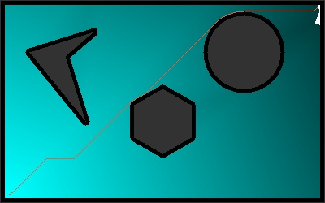

# Dijkstra Search

### Required Modules:
- numpy, openCV, heapq

### Files Info
- ### 'main.py' file :
    - Map is created and Path is searched from given start to goal

- ### 'maputils.py' file
    - contains the map class and obstacle classes

- ### 'dijsktra.py' file 
    - contains dijsktra class 

- ### 'nodeclass.py' file 
    - contains the node class

### To Run the code:
- run 'python3 main.py'
- input start and goal positions in the prompt
- after a path is found. exploration is visualized and saved as 'result.mp4' 

## Result

sample saved video <a href="https://drive.google.com/file/d/15jOXQU6S-BWKdlwMldeloq7jviqo3YRt/view?usp=sharing">link</a>